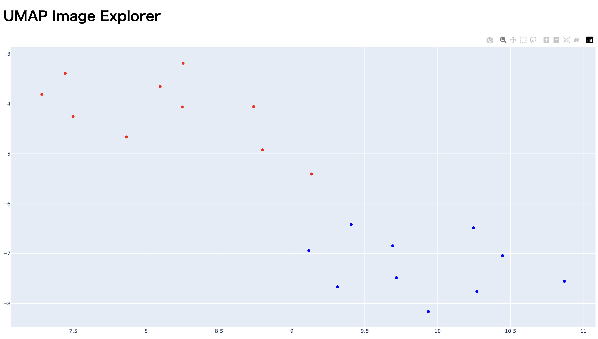
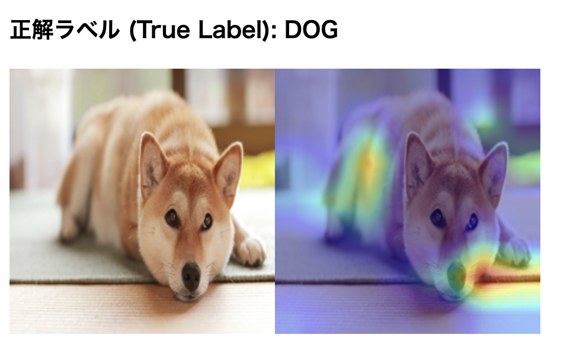
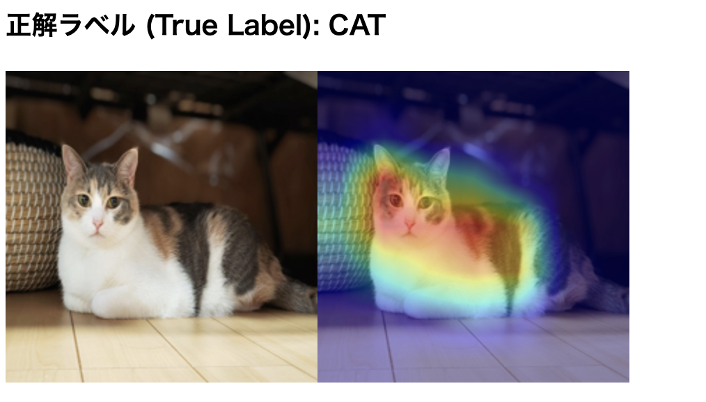

# UMAP Image Explorer

## 概要

これは、画像データセットの特徴量をUMAPで2次元に圧縮し、インタラクティブに可視化するためのDashアプリケーションです。

* **特徴量抽出**: 学習済みのResNet-50モデルを使用します。
* **次元削減**: UMAP (Uniform Manifold Approximation and Projection) を使用します。
* **可視化**: Plotlyを使用して、2次元の散布図をインタラクティブに表示します。
* **分析**: 散布図上の点をクリックすると、対応する元画像と、モデルの判断根拠を可視化するGrad-CAMヒートマップが表示されます。

## 動作デモ

## このツールで何ができるか？

このアプリケーションは、大量の画像データを「地図」のように可視化し、AIモデルの「思考」を覗き見るためのツールです。以下のステップで、複雑な画像の世界を探検できます。

1. **特徴量の抽出**: まず、AI（ResNet-50）が各画像を「見て」、その画像が持つ「本質的な特徴」を数値のリスト（特徴量ベクトル）に変換します。これは、人間が写真を見て「これは毛がふわふわした猫だ」と感じるように、AIが画像のニュアンスを捉えるプロセスです。

2. **次元削減 (UMAP)**: AIが抽出した特徴量は、数千次元にも及ぶ非常に複雑なものです。これを人間が理解できる2次元の平面（x, y座標）に「圧縮」するのがUMAPの役割です。このとき、元の高次元空間で「似ていた」画像同士は、2次元平面上でも近くの点に配置されるように工夫されています。

3. **可視化と分析**: 圧縮されたデータは、画面上に散布図としてプロットされます。これにより、以下のような分析が可能になります。
   * **データ全体の構造を把握**: 猫の画像と犬の画像が、どの程度はっきりと分かれているか（または混ざり合っているか）を一目で確認できます。
   * **モデルの判断根拠を探る**: 点をクリックすると表示されるGrad-CAMヒートマップは、AIが画像の「どこを見て」そのカテゴリを判断したかを示します。例えば、猫の画像でAIがきちんと顔や耳に注目しているか、あるいは背景の無関係な部分を見ているか、といったモデルの「思考のクセ」を分析できます。
   * **エラー分析**: 猫と犬のクラスターの中間に位置するような「あいまいな点」は、モデルが分類を間違えやすい画像である可能性があります。このような外れ値や分類困難なサンプルを効率的に見つけ出すことができます。

このように、本ツールは単に画像を並べるだけでなく、データセットの俯瞰的な理解と、AIモデルの内部動作の解釈を助ける強力な分析ツールとして機能します。